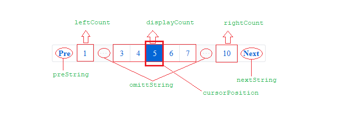

# Paginate

> a web paginate control, follow the bootstarp style.
> the effect is shown below


### Depend

Do not rely on third-party libraries. But requirement the follow features in browser :

- Promise Object(if you use ajax model)
- Flex layout(css)

### Install

1. Scripts reference

```html
<script src="/dist/Paginate.min.js"></script>
```

or

```html
<link href="/dist/paginate.css" rel="stylesheet" />
<script src="/dist/Paginate.js"></script>
```

2. Npm install

```
$ npm install --save-dev web-paginate
```

### Instructions

#### use:

```js
var p = new Paginate(options); // type1
var p = new Paginate(options,function(data){console.log(data)}); // type2
```

#### set options

first, let's take a look at the settings of the public field

```js
var options = {
    omittString: 'иии', // public field
    preString: 'Pre',   // public field
    nextString: 'Next', // public field
    displayCount: 5,    // public field
    cursorPosition: 3,  // public field
    leftCount: 1,       // public field
    rightCount: 1,      // public field
    itemsCount: null,   // public field, set the number of pages to display the item, can not be ignored
    totalPages: null,   // public field
    onClick: null,      // public field, will invoke if user click any page number, the same as the second parameter in constructor function
    contanier: null,    // public field, which element to contanier Paginate
    currentSelect: 1    // public field, when init, which page number should be select first
};
```


in addition to that. there are three other ways to set up private field:

- use local data
- use ajax data
- customize

1. use local data

 ```js
var options = {
    data:[1,2,3,4...],  // local data
};
```

2. use ajax data
```js
var options = {
    ajax: null,                         // set ajax link
    ajaxMethod: 'GET',                  // request method
    ajaxData: null,                     // request data, support object
    ajaxTotalPagesName: 'totalPages',   // in ajax return value, which key specify the totalPages
    ajaxDataName: 'data',               // in ajax return value, which key specify the data
    onAjaxFail: null,                   // when request fail
    onAjaxRequestting: null             // before invoke the ajax send function
};

// note: just support json dataType
```

3. customize
```js
var options = {
    dataHandle: function(index, options, callBack, http){
        // index: current page number
        // options: current options
        // callBack: when you get the data, please invoke it as: callBack(data)
        // http: the tool for ajax
    }
};
```

*demo: [click to see demo](demo.html)*

#### return value

```js
var p = new Paginate(options);

p.dom           // the paginate dom
p.preDom        // the pre flag dom
p.nextDom       // the next flag dom
p.options       // options
p.optionsSet()  // set the new options
p.adjustment()  // adjustment layout
```

### Contact
503960146@qq.com